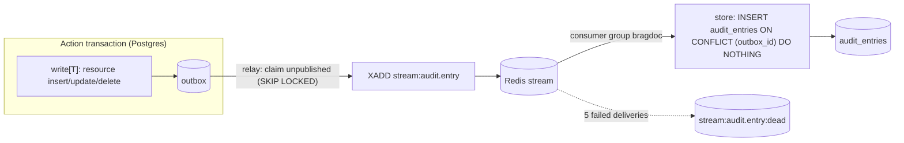

# Transactional outbox with Redis Streams

## Context and Problem Statement

[PRD-0009](../prd/0009-audit-log.md) requires that every state-changing action produce exactly one audit entry, and that an action never succeeds without it (FR-1). The first build inserted the entry into `audit_entries` inside the action's transaction. That is atomic, but it couples every write to the audit store's schema and indexes, and leaves no queue for other consumers of the same events (notifications, webhooks, an external SIEM later). How do we take audit off the write path without ever losing an entry?

## Decision Drivers

* No lost entries: the event must commit or roll back with the action.
* No new infrastructure: Postgres and Redis are already deployed ([ADR-0005](0005-postgresql-as-primary-database.md), [ADR-0006](0006-redis-as-cache.md)).
* Delivery to a queue that other consumers can join later.
* The degradation rule ([ADR-0012](0012-hexagonal-backend-layout.md)): a feature may fail because Postgres is down, never because Redis is.
* Idempotent, retryable consumption.

## Considered Options

* Direct insert into `audit_entries` in the action's transaction (the first build)
* Outbox table, with a relay that inserts `audit_entries` directly (no queue)
* Outbox table, relayed to Redis Streams
* Outbox table, relayed to a new broker (NATS, RabbitMQ)

## Decision Outcome

Chosen option: "Outbox table, relayed to Redis Streams", because it keeps the atomicity of the direct insert, adds a real queue using a store we already run, and lets Redis fail without failing any action.

Rules:

* **Writes.** Every resource insert, update, or delete goes through `write[T](ctx, db, auditEntry, fn)` in `backend/internal/adapters/postgres/outbox.go`. It opens the tenant transaction, snapshots the actor and document names before `fn` when the document is known, runs `fn`, enqueues the message after `fn`, and returns `fn`'s result. `fn` returning `errNoChange` commits without a message. Only writes that open their own transaction (Telegram link, invitation accept at sign-in) call `audit()`/`enqueue()` directly.
* **Outbox.** One generic table (`id, tenant_id, topic, payload jsonb, created_at, published_at`). Tenant code may only insert and read its own rows (RLS); the relay runs under the provisioning flag. Published rows are purged after 7 days.
* **Relay.** The worker claims up to 100 unpublished rows (`FOR UPDATE SKIP LOCKED`) every second, `XADD`s them to `stream:<topic>`, and marks them published in the same transaction. A failed publish rolls back; the rows wait for the next tick.
* **Delivery.** At-least-once. Consumer group `bragdoc` reads from the start of the stream (so nothing published before the group exists is skipped), acks and deletes each entry after its handler succeeds, retakes entries idle for over a minute (`XAUTOCLAIM`), and after 5 deliveries copies the entry to `stream:<topic>:dead`. Every consumer must be idempotent; the audit consumer stores with `ON CONFLICT (outbox_id) DO NOTHING`.
* **Topics.** `audit.entry` (PRD-0009). New topics add a constant in `domain/outbox.go`, an `enqueue` call in the write that produces them, and a `Consume` call in the worker.

### Consequences

* Good, because an action can never commit without its event, and no event survives a rolled-back action.
* Good, because Redis being down only delays audit entries; actions keep working and the outbox drains when Redis returns.
* Good, because new consumers subscribe to a stream instead of touching every write path.
* Bad, because audit entries are eventually consistent: readable about 1–2 s after the action. The frontend refetches once more after 2 s.
* Bad, because the worker must run for entries to appear (`bragdoc worker` or `bragdoc all`).
* Neutral, because entries are listed in consume order, and `at` comes from the app clock at enqueue time. Strict ordering would need `ORDER BY (at, id)`.

### Confirmation

Integration tests: one entry per audited action after draining the outbox; a failed action leaves no outbox row; relay is all-or-nothing; redelivered messages store once; a poison message lands in the dead stream; an end-to-end test runs Postgres and Redis containers through the worker's relay and consumer.

## Pros and Cons of the Options

### Direct insert

* Good, because simplest and immediately consistent.
* Bad, because every write depends on the audit table, and there is no queue for other consumers.

### Outbox, relay inserts directly

* Good, because no Redis dependency for audit.
* Bad, because still no queue; a second consumer means another relay.

### Outbox with Redis Streams

* Good, because atomic, queued, and built on deployed infrastructure.
* Bad, because more moving parts (relay, consumer group, dead letters) and eventual consistency.

### Outbox with a new broker

* Good, because richer routing and tooling.
* Bad, because a new container, client library, and operational surface for a single consumer today.
