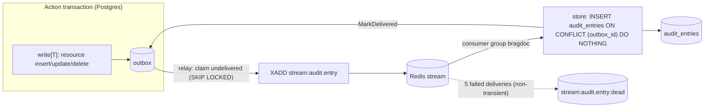

# Audit outbox: design

Date: 2026-10-09. Status: approved. Changes how [PRD-0009](../prd/0009-audit-log.md) audit entries are written (see `2026-10-09-audit-log-design.md`). Adds ADR-0015 and amends ADR-0006. Ships on `feat/audit-log` (PR #14).

## Decisions taken during brainstorming

| Topic | Decision |
|---|---|
| Pattern | Transactional outbox. The action's transaction writes an outbox message; a relay publishes it to a queue; a consumer stores the audit entry. Nothing is lost: the message commits or rolls back with the action. |
| Queue | Redis Streams (already deployed, ADR-0006). Rejected: outbox table only (no queue for other consumers), new broker such as NATS or RabbitMQ (new infrastructure for one consumer). |
| Helpers | Generic: one `outbox` table for any topic, `enqueue` for any payload, a generic relay and consumer. Audit is the first topic (`audit.entry`). Rejected: an audit-only outbox. |
| Repo writes | Every resource insert/update/delete goes through one generic helper, `write[T]`, which opens the tenant transaction, runs the write, enqueues the audit message, and returns the write's result. Repos never call `audit()` or `enqueue()` themselves, except the two writes that open their own transaction (Telegram link, invitation accept at sign-in). |
| Wake-up | The relay polls every second. LISTEN/NOTIFY can come later without changing anything else. |
| Delivery | At-least-once with delivery confirmation: the consumer marks each row delivered; the relay republishes rows still undelivered 10 min after their last publish, at most 5 publishes. Redis losing entries (restart, flush) only delays them. |
| Consistency | Entries become readable about 1–2 s after the action. FR-1 still holds: an action never commits without its audit message. |
| Branch | Same branch and PR as the audit log (#14), so main never gets the direct-insert version. |

## Architecture



## Data

Migration `0008_outbox`:

- `outbox (id bigint identity PK, tenant_id uuid NOT NULL, topic text NOT NULL, payload jsonb NOT NULL, created_at timestamptz NOT NULL DEFAULT now(), published_at timestamptz, delivered_at timestamptz, attempts int NOT NULL DEFAULT 0)`. `published_at` is the last publish, `attempts` counts publishes, `delivered_at` is set by the consumer.
- Partial index `outbox_pending_idx ON outbox (id) WHERE delivered_at IS NULL`, and `outbox_tenant_id_idx ON outbox (tenant_id)`.
- RLS: `tenant_read` (SELECT) and `tenant_append` (INSERT) for actions, so tenants can never update or delete messages; `provisioning_all` opens the table under `app_provisioning()` because the worker reads and updates across tenants (same model as `export_jobs`).
- The app role gets SELECT, INSERT, UPDATE, DELETE (the worker marks published and delivered, and purges).
- `audit_entries.outbox_id bigint UNIQUE` (nullable; rows from before this change have none). Makes the consumer idempotent.

## Write side

In `adapters/postgres/outbox.go`:

```go
// enqueue writes one message in the caller's transaction. Any topic, any JSON payload.
func enqueue(ctx context.Context, q *sqlcgen.Queries, topic string, payload any) error

// write runs fn and its audit outbox message in one tenant transaction and returns
// fn's result. Every resource insert/update/delete goes through it.
func write[T any](ctx context.Context, db *DB, a domain.AuditEntry,
	fn func(ctx context.Context, q *sqlcgen.Queries, a *domain.AuditEntry) (T, error)) (T, error)
```

`write` in one transaction:

1. If `a.DocumentID` is known, **snapshot** the actor (name, email) and the document title before `fn`. The title is captured while the row exists (`document.deleted`, FR-12), and an unknown actor or document is rejected early (`ErrNotFound`). A rename names the title as it was, with `changed_fields: ["title"]`.
2. Run `fn`. It may fill ids the database assigns (`a.DocumentID` on document create, `a.TargetID` on log create and invitations).
3. If `a.DocumentID` was only set by `fn` (or never), snapshot after `fn`.
4. Always **enqueue after** `fn`, once every id is filled.
5. `fn` returning `errNoChange` commits without a message (idempotent Telegram unlink).
6. Commit. Any failure rolls back the action and its message (FR-1).

The snapshot is one query (`AuditSnapshot`, the same LEFT JOINs on `users` and `documents` as the old direct insert; no row when an id matches nothing). The payload is a Go struct with JSON tags (`auditMessage`, `at` set at enqueue time), so `enqueue` stays generic and the consumer decodes the same struct.

`write` sits on a lower-level `inTenantTx[T]`. The two writes that open their own transaction (Telegram link with `WithTenant(l.TenantID)`; invitation-accept during provisioning) call `audit(ctx, q, a)` (snapshot then enqueue) directly.

## Relay and consumer

Both run in the worker (`bragdoc worker`, and `bragdoc all`). The `EXPORT_KEY` check now only disables exports.

**Relay** (`OutboxRepo.Relay` in the postgres adapter; it receives the publish function from `cmd`, so adapters do not import each other), every second:

1. Under `WithProvisioning`: claim up to 100 undelivered rows that were never published, or were last published over 10 minutes ago (`redeliverAfter`) and fewer than 5 times (`maxAttempts`), `ORDER BY id FOR UPDATE SKIP LOCKED`.
2. Publish them (`XADD stream:<topic>` with `id`, `tenant_id`, `payload`).
3. Mark them published (`published_at = now()`, `attempts + 1`) and commit. A failed publish rolls back: rows stay for the next tick. A crash after `XADD` and before commit republishes: delivery is at-least-once.
4. At most once an hour, purge rows delivered over 7 days ago.

Redelivery covers entries lost inside Redis (restart, failover, flush): until the consumer confirms a row, the relay keeps republishing it. A row that reaches 5 publishes undelivered stays in the outbox for an operator (ADR-0015, Operations).

**Consumer** (`redis.Stream.Consume`): consumer group `bragdoc` on `stream:audit.entry`; `XREADGROUP … BLOCK 5s`; call the handler; on success `XACK` and `XDEL` in one transaction (one group per stream, so the stream only holds unacked work). A failed handler leaves the message pending; `XAUTOCLAIM` retakes messages idle for over a minute. Transient errors (`domain.ErrUnavailable`, context cancelled or deadline exceeded: Postgres down, shutdown) stay pending however often they were delivered. After 5 deliveries failing otherwise, the message is copied to `stream:<topic>:dead`, acked, deleted, and logged at error. The consumer name is `host:pid`.

**Audit handler** (in `cmd`): `AuditRepo.Store` decodes `auditMessage`, then `WithTenant(msg.TenantID)` and `INSERT INTO audit_entries … ON CONFLICT (outbox_id) DO NOTHING` (`StoreAuditEntry`). `at` comes from the payload. The payload format is the `auditMessage` struct on both ends. Then `OutboxRepo.MarkDelivered(id)`; if that fails the handler returns the error and the message is retried (Store is idempotent).

No new ports: no use case calls the relay or the consumer; `cmd` wires the adapter functions together (`outbox.Relay(ctx, stream.Publish)`, `stream.Consume(ctx, "audit.entry", store)` where `store` is `audits.Store` then `outbox.MarkDelivered`).

## Frontend

Shared mutation helpers keep invalidating `["audit"]` immediately and once more after 2 s through `refreshAuditSoon(qc)`. The Audit page also refetches on window focus (react-query default).

## Errors and degradation

- The outbox insert is the only new failure at action time; it fails the action (FR-1).
- Redis down: actions still succeed (ADR-0012 degradation rule holds); entries queue in the outbox and appear once Redis is back. Relay and purge each warn at most once a minute.
- Redis loses entries: compose runs Redis with AOF (`appendfsync everysec`) and `noeviction`; anything lost anyway is republished after 10 minutes.
- Postgres down while consuming: the handler returns `ErrUnavailable`, the message stays pending and is retried, never dead-lettered.
- Other consumer failures retry through the pending list, then dead-letter. Dead entries are for inspection only: the outbox row stays undelivered and is republished until the attempt cap. No metrics yet (`ponytail:` the worker has no `/metrics`).

## Testing

- `write[T]` (Postgres integration): snapshot before or after `fn`, enqueue after; title survives a delete; `fn` error leaves no outbox row; unknown actor or document → `ErrNotFound` and rollback; `errNoChange` commits without a message.
- Outbox (Postgres integration, `TestOutboxRelayAndStore`): the message commits with the action; a failed publish rolls back; duplicate Store keeps one entry; tenants cannot update or delete messages, nor see another tenant's; a rolled-back action leaves no message.
- Delivery confirmation (Postgres integration, `TestOutboxDeliveryConfirmation`, time simulated by backdating): a published row is not reclaimed before `redeliverAfter` and is after; `MarkDelivered` stops redelivery; relaying stops at `maxAttempts` and resumes after `attempts = 0`; Purge removes only rows delivered over 7 days ago.
- Stream (Redis integration, `TestStreamPublishConsume`): entries published before the group exists are delivered; acked entries are deleted and not redelivered; a poison message is dead-lettered after `maxDeliveries`; an `ErrUnavailable` handler error past `maxDeliveries` is not dead-lettered and is handled once it succeeds; Publish fails while Redis is down.
- End to end (`cmd`, `TestOutboxEndToEnd`, Postgres and Redis containers through `runOutbox`): an action reaches `audit_entries` and its row gets `delivered_at`; a message published and then lost with Redis (`FLUSHALL`) is republished and stored.
- Repo tests drain the outbox with `drain` (relay, Store, MarkDelivered) before asserting one entry per action.
- App unit tests unchanged (ports unchanged).
- Frontend: Activity refresh test uses fake timers for the delayed refetch.

## Docs

- ADR-0015: transactional outbox with Redis Streams (decision, at-least-once with idempotent consumer, `write[T]` rule, topics, dead-letter, rejected options).
- ADR-0006: amended; Redis also carries event streams; audit entries are delayed while it is down; Redis runs with AOF and `noeviction`.
- PRD-0009: FR-1 wording, NFR-2 covers the outbox insert, decisions log row.
- `2026-10-09-audit-log-design.md`: points to this design for the write path.
- `.claude/skills/backend-endpoint/SKILL.md`: resource writes go through `write[T]`.
- `docs/README.md`: ADR index.
